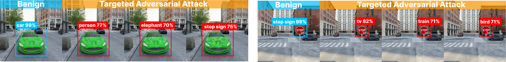

### 3DGS vulnerabilities are underexplored. We highlight new potential threats to robotic learning for autonomous navigation and other safety-critical 3DGS applications.
---

### CLOAK attack conceals adversarial textures visible only from certain views


#### CLOAK is a poisoning attack method - benign images are replaced with adversarial images in the 3DGS training dataset for targeted camera viewpoints. 


---

### DAGGER manipulates Gaussian attributes to induce misdetections on Faster R-CNN. 


#### DAGGER generalizes projected gradient descent attack by exploiting the differentiability of the 3DGS scene representation to manipulate splat color, scaling, translation, rotation, or alpha attributes to fool object detectors.

## Credits
Led by [Matthew Hull](https://matthewdhull.github.io), 3D Gaussian Vulnerabilities is a result of a collaboration between the [Polo Club of Data Science](https://poloclub.github.io) at Georgia Tech and [Technology Innovation Institute](https://www.tii.ae). 3DGaussian Splat Vulnerabilities has been created by [Matthew Hull](https://matthewdhull.github.io), [Haoyang Yang](https://alexanderyang.me), [Pratham Mehta](https://twixupmysleeve.wixsite.com/home), [Mansi Phute](https://mphute.github.io), [Aeree Cho](https://aereeeee.github.io), Haoran Wang, [Matthew Lau](https://sites.google.com/view/matthewlauende/home), [Wenke Lee](http://wenke.gtisc.gatech.edu), Willian Lunardi, Martin Andreoni, and [Duen Horng Chau](https://poloclub.github.io/polochau/).

# Citation
To learn more about 3D Gaussian Splat Vulnerabilities, please read our [paper](https://arxiv.org/pdf/2506.00280), presented at CVPR 2025 Workshop on Neural Fields Beyond Conventional Cameras:
```latex
@misc{hull20253dgsvulnerabilities,
    title={3D Gaussian Splat Vulnerabilities}, 
    author={Matthew Hull and Haoyang Yang and Pratham Mehta and Mansi Phute and Aeree Cho and Haoran Wang and Matthew Lau and Wenke Lee and Willian Lunardi and Martin Andreoni and Duen Horng Chau},
    booktitle = {CVPR Workshop on Neural Fields Beyond Conventional Cameras},
    year={2025}
}
```